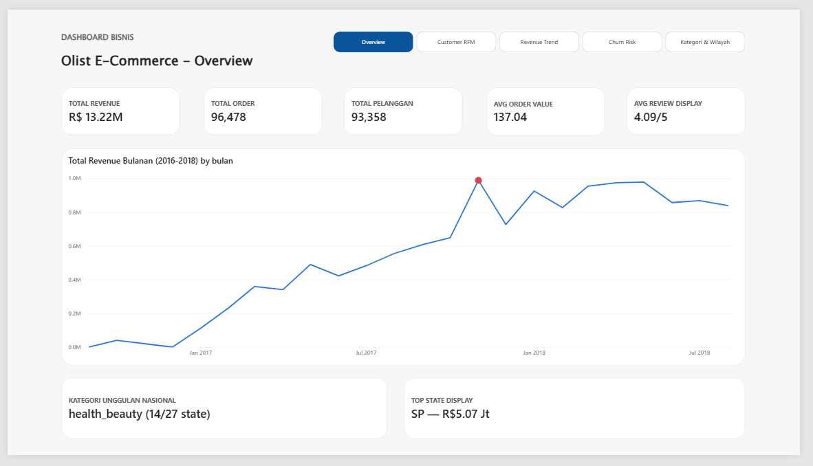
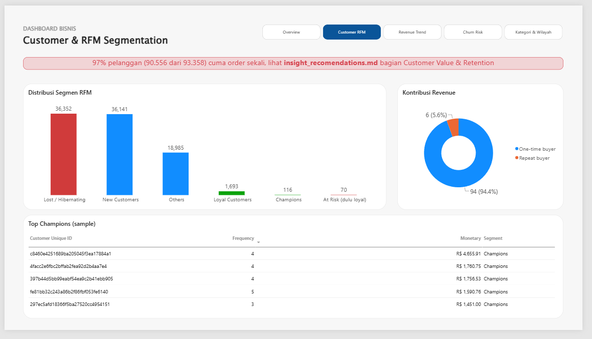
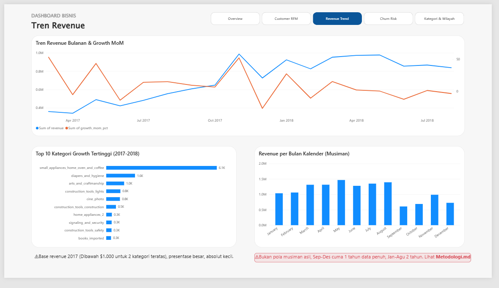
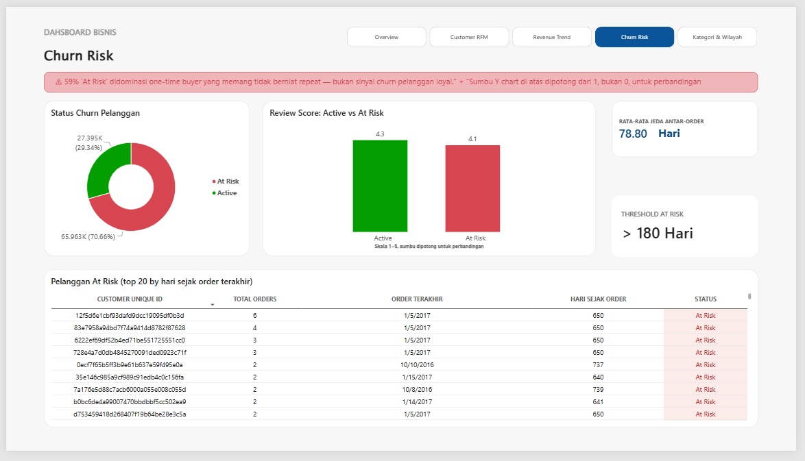
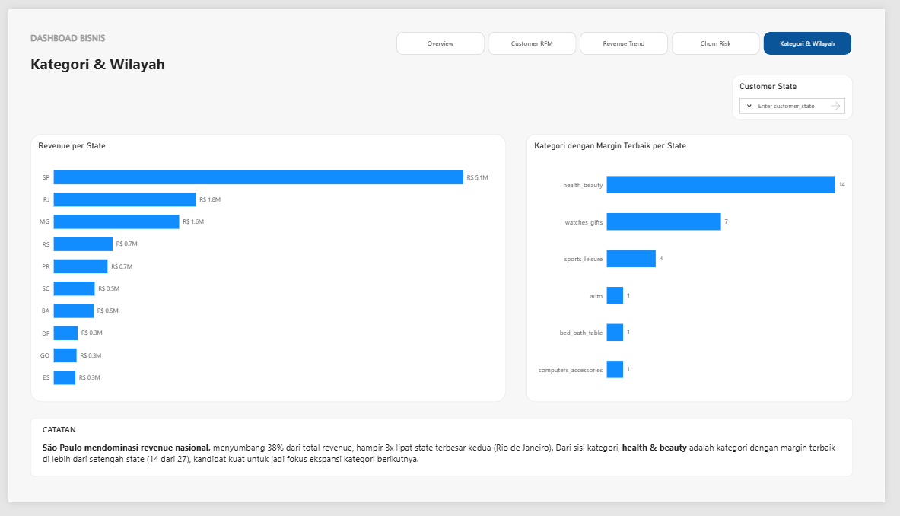

# Dashboard Bisnis SQL — Olist Brazilian E-Commerce

Portfolio Data Analyst: dashboard bisnis berbasis **SQL kompleks (CTE, window function, multi-table join)** di atas dataset e-commerce nyata, dibangun untuk menjawab pertanyaan bisnis konkret — bukan sekadar kumpulan chart.

  

---

## Daftar Isi

- [Latar Belakang](#latar-belakang)
- [Dataset](#dataset)
- [Business Questions](#business-questions)
- [Tech Stack](#tech-stack)
- [Struktur Repo](#struktur-repo)
- [Metodologi](#metodologi)
- [Dashboard](#dashboard)
- [Key Insights & Rekomendasi Bisnis](#key-insights--rekomendasi-bisnis)
- [Cara Reproduce](#cara-reproduce)
- [Temuan Teknis yang Layak Disorot](#temuan-teknis-yang-layak-disorot)

---

## Latar Belakang

Project ini dibuat untuk mensimulasikan pekerjaan seorang Data Analyst end-to-end: mulai dari merumuskan pertanyaan bisnis, audit kualitas data mentah, menulis SQL analitis (bukan sekadar `SELECT *`), sampai menyajikan hasilnya dalam dashboard interaktif yang bisa dipakai pengambil keputusan.

Fokus utamanya ada di **kedalaman SQL** — RFM segmentation, window function untuk growth rate, dan analisis churn — dengan Power BI berperan sebagai lapisan presentasi, bukan tempat logika bisnis di-compute ulang.

## Dataset

**[Olist Brazilian E-Commerce Public Dataset](https://www.kaggle.com/datasets/olistbr/brazilian-ecommerce)** dari Kaggle — data transaksi nyata (anonim) dari marketplace terbesar Brasil, periode 2016–2018.

| Item | Detail |
|---|---|
| Jumlah order | ~99.441 |
| Jumlah pelanggan unik | 96.096 (`customer_unique_id`) |
| Periode | September 2016 – Agustus 2018 |
| Jumlah file mentah | 9 CSV (customers, orders, order_items, order_payments, order_reviews, products, sellers, geolocation, category translation) |
| Bahasa asli | Portugis (nama kategori produk) |

## Business Questions

Dashboard ini menjawab pertanyaan bisnis berikut (daftar lengkap 12 pertanyaan di `docs/business_questions.md`):

1. **Customer Value** — Siapa pelanggan paling bernilai, dan bagaimana segmentasinya (RFM)?
2. **Revenue Trend** — Bagaimana tren revenue bulanan, dan kategori apa yang tumbuh/turun dari 2017 ke 2018?
3. **Seasonality** — Apakah ada pola musiman dalam revenue sepanjang tahun kalender?
4. **Churn Signal** — Sinyal apa yang menunjukkan pelanggan berisiko churn, dan apakah itu berkorelasi dengan review score?
5. **Category & Region** — Kategori produk apa yang paling profitable di tiap wilayah, dan wilayah mana yang paling bernilai dari sisi revenue?

## Tech Stack

| Kategori | Tool |
|---|---|
| Database | PostgreSQL |
| DB Client | DBeaver |
| Data Loading & Validasi | Python (pandas, SQLAlchemy, psycopg2) di Jupyter Notebook |
| Dashboard | Power BI Desktop |
| Sumber Dataset | Kaggle (`kagglehub`) |
| Versioning | Git + GitHub |

## Struktur Repo

```
olist-sql-dashboard/
├── data/
│   ├── raw/                          # 9 CSV asli dari Kaggle (tidak di-commit, lihat .gitignore)
│   └── processed/                    # hasil export tiap query untuk validasi
├── sql/
│   ├── 01_schema.sql                 # DDL 9 tabel raw (tanpa constraint)
│   ├── 02_finalize_schema.sql        # PRIMARY KEY, FOREIGN KEY, INDEX, view dedup
│   ├── 03_rfm_analysis.sql           # Q1 RFM segmentation, Q2 buyer type
│   ├── 04_revenue_trend.sql          # Q3 revenue trend, Q4 category growth, Q5 seasonality
│   ├── 05_churn_indicator.sql        # Q6 churn gap & status, Q7 review score vs churn
│   ├── 06_category_region_analysis.sql # Q8 kategori per state, Q9 revenue per state
│   ├── 07_overview_kpi.sql           # agregat KPI untuk Halaman 1 dashboard
│   └── 08_category_win_count.sql     # pendukung info card kategori unggulan
├── notebooks/
│   ├── 00_download_data.ipynb        # download dataset via kagglehub
│   ├── 01_load_to_postgres.ipynb     # load 9 CSV ke Postgres
│   ├── 02_data_audit.ipynb           # audit kualitas data
│   └── 03_query_validation_viz.ipynb # validasi visual tiap hasil query
├── dashboard/
│   ├── olist_dashboard.pbix
│   └── screenshots/
│       ├── 01_overview.png
│       ├── 02_customer_rfm.png
│       ├── 03_revenue_trend.png
│       ├── 04_churn_risk.png
│       └── 05_kategori_wilayah.png
├── docs/
│   ├── business_questions.md
│   ├── methodology.md
│   ├── insights_recommendations.md
│   ├── fase2_data_audit.md
│   ├── fase3_schema_finalization.md
│   ├── fase4_query_development.md
│   ├── fase6_dashboard_building.md
│   ├── fase6_langkah_build.md
│   ├── fase6_langkah_build_halaman5.md
│   └── fase7_dokumentasi_publish.md
├── README.md
├── requirements.txt
└── .gitignore
```

## Metodologi

Pendekatan yang dipakai: **audit dulu, baru constrain** — bukan asumsi data bersih dari awal.

1. **Layer raw tanpa constraint.** 9 tabel dibuat tanpa `PRIMARY KEY`/`FOREIGN KEY` supaya proses load tidak gagal karena masalah data, dan masalah itu justru yang ingin ditemukan lewat audit — bukan disembunyikan lewat constraint yang menolak baris bermasalah di awal.
2. **Audit sebelum menulis query analitis** — ditemukan: 814 `review_id` duplikat, 2 kategori produk tanpa terjemahan resmi, 775 order tanpa `order_items` (valid, bukan bug).
3. **Constraint ditambahkan setelah tahu persis letak masalahnya** — `PRIMARY KEY`/`FOREIGN KEY`/`INDEX` final, plus `VIEW order_reviews_dedup` untuk menangani duplikasi tanpa mengubah data asli.
4. **`customer_unique_id`, bukan `customer_id`, dipakai untuk identitas pelanggan** — `customer_id` di dataset ini unik per *order*, bukan per pelanggan; salah pakai kolom ini akan merusak seluruh analisis RFM dan retensi.

Detail lengkap + seluruh keputusan desain ada di [`docs/methodology.md`](docs/methodology.md).

## Dashboard

Dashboard 5 halaman, dibangun dengan mengimpor **hasil query SQL langsung** ke Power BI (Native SQL statement) — bukan raw table + hitung ulang pakai DAX. Tujuannya supaya logika bisnis (RFM scoring, growth rate, churn threshold) tetap satu sumber kebenaran di SQL, dan Power BI murni jadi lapisan visualisasi.

| Halaman | Isi |
|---|---|
| **1. Overview** | KPI utama (revenue, order, pelanggan, AOV, review score), tren revenue bulanan, kategori & state unggulan |
| **2. Customer & RFM** | Distribusi segmen RFM, kontribusi revenue one-time vs repeat buyer, tabel Top Champions |
| **3. Revenue Trend** | Tren revenue & growth MoM, top 10 kategori dengan pertumbuhan tertinggi, pola musiman bulanan |
| **4. Churn Risk** | Status churn pelanggan, perbandingan review score Active vs At Risk, tabel pelanggan berisiko |
| **5. Kategori & Wilayah** | Revenue per state, top 10 state, kategori dengan margin terbaik per state |

**Screenshot:**

| Overview | Customer & RFM |
|---|---|
|  |  |

| Revenue Trend | Churn Risk |
|---|---|
|  |  |

| Kategori & Wilayah |
|---|
|  |

## Key Insights & Rekomendasi Bisnis

Ringkasan — detail lengkap tiap poin (termasuk angka pendukung) ada di [`docs/insights_recommendations.md`](docs/insights_recommendations.md).

- **97% pelanggan cuma order sekali.** Basis pelanggan berulang sangat tipis → peluang besar di program retensi/loyalitas dibanding terus akuisisi pelanggan baru.
- **Revenue sangat terkonsentrasi secara geografis.** São Paulo menyumbang 38,3% dari total revenue nasional — sekitar 2,9x lipat state terbesar kedua (Rio de Janeiro).
- **`health_beauty` adalah kategori paling konsisten unggul** — kategori dengan margin terbaik di 14 dari 27 state, jauh di atas kategori lain.
- **"At Risk" churn (>180 hari tanpa order) 70,66% dari pelanggan — tapi mayoritas memang one-time buyer yang tidak berniat repeat**, bukan sinyal churn pelanggan loyal yang hilang. Rekomendasi: fokuskan strategi retensi ke segmen yang **pernah** repeat lalu berhenti, bukan ke seluruh populasi At Risk.
- **Pola musiman bulanan (Sep–Des vs Jan–Agu) belum representatif** — Sep–Des cuma punya 1 tahun data penuh (2016 pendek, 2018 tidak sampai akhir tahun), sedangkan Jan–Agu punya 2 tahun. Perbedaan yang terlihat kemungkinan besar dari jumlah tahun data yang tidak seimbang, bukan pola musiman asli — caveat ini penting supaya tidak salah ambil keputusan.

## Cara Reproduce

Butuh: PostgreSQL, DBeaver (atau client SQL lain), Python 3.9+, Power BI Desktop (Windows).

1. **Clone repo & install dependency Python**
   ```bash
   git clone <url-repo-ini>
   cd olist-sql-dashboard
   pip install -r requirements.txt
   ```
2. **Siapkan koneksi database** — buat file `.env` di root (lihat contoh variabel di `notebooks/01_load_to_postgres.ipynb`): `DB_HOST`, `DB_PORT`, `DB_NAME`, `DB_USER`, `DB_PASSWORD`
3. **Download dataset** — jalankan `notebooks/00_download_data.ipynb` (otomatis lewat `kagglehub`, hasil masuk ke `data/raw/`)
4. **Buat schema & load data**
   - Jalankan `sql/01_schema.sql` di DBeaver (buat 9 tabel raw)
   - Jalankan `notebooks/01_load_to_postgres.ipynb` (load CSV ke Postgres)
5. **Finalisasi schema** — jalankan `sql/02_finalize_schema.sql` per-STEP (lihat panduan di `docs/fase3_schema_finalization.md`)
6. **Jalankan query analitis** — file `sql/03` sampai `sql/08`, urutan bebas (tidak saling bergantung)
7. **Buka dashboard** — buka `dashboard/olist_dashboard.pbix` di Power BI Desktop, arahkan ulang koneksi Postgres ke instance lokal kamu (Power BI akan minta re-enter credentials di query pertama kali dibuka)

## Temuan Teknis yang Layak Disorot

Beberapa hal yang sengaja dicatat sebagai bahan diskusi teknis (misalnya untuk interview):

- **Bug `NTILE()` yang non-deterministik ditemukan lewat cross-validation SQL vs Python.** Frequency score RFM awalnya pakai `NTILE(5)`, tapi 97% pelanggan punya frequency=1 — kolom yang sangat skewed membuat `NTILE` membagi nilai yang identik ke 5 quintile berbeda secara acak (match rate cuma 22,6% saat divalidasi ulang). Solusi: ganti jadi business-rule `CASE` statement untuk F-score, dan tambahkan tie-breaker deterministik di R & M score. Detail di `docs/methodology.md` poin 6.
- **Reference date untuk churn harus dihitung dari SEMUA order, bukan cuma yang `delivered`** — kesalahan ini sempat muncul di script validasi Python (bukan di SQL project), dan terkonfirmasi lewat cross-check manual.
- **Top N filter Power BI tidak reliable saat digabung dengan filter lain pada visual yang sama** — diselesaikan dengan mengganti ke kolom rank hasil `RANKX()` di DAX, difilter manual, alih-alih memakai fitur Top N bawaan.

---

*Dibuat sebagai bagian dari portfolio Data Analyst. Dataset milik Olist, didistribusikan ulang oleh Olist & André Sionek di Kaggle di bawah lisensi CC BY-NC-SA 4.0.*
